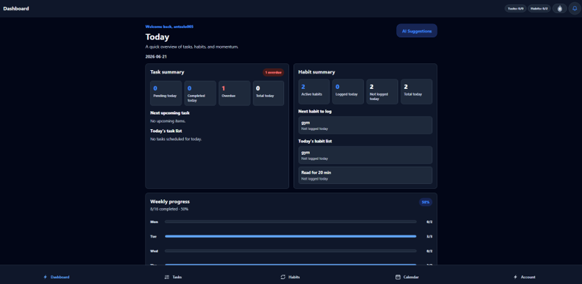
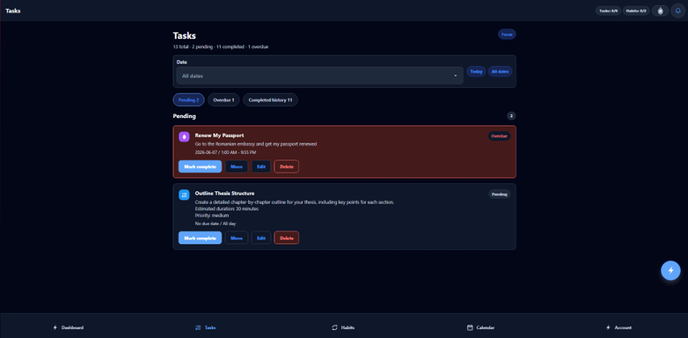
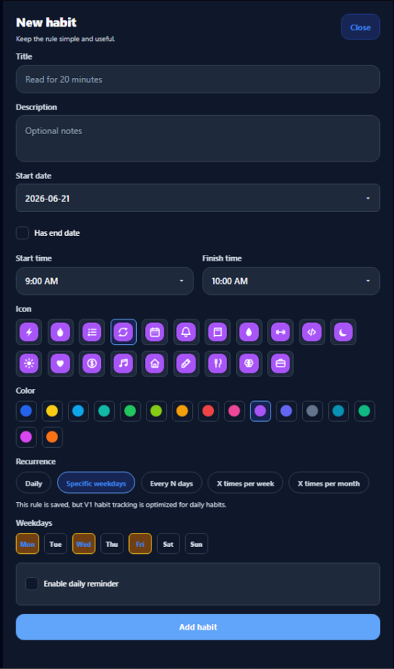
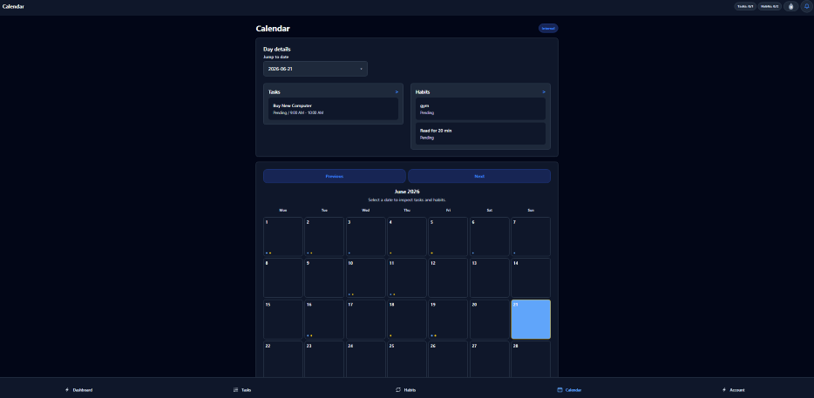
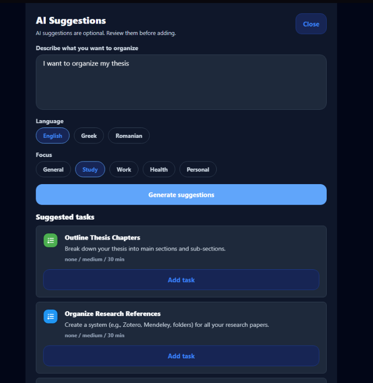
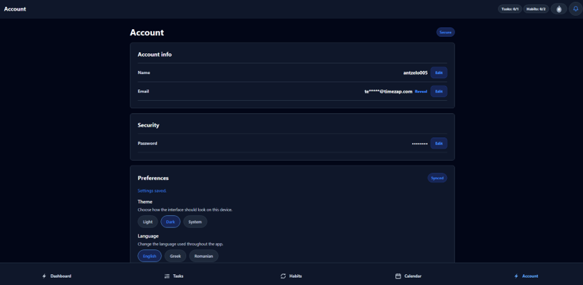
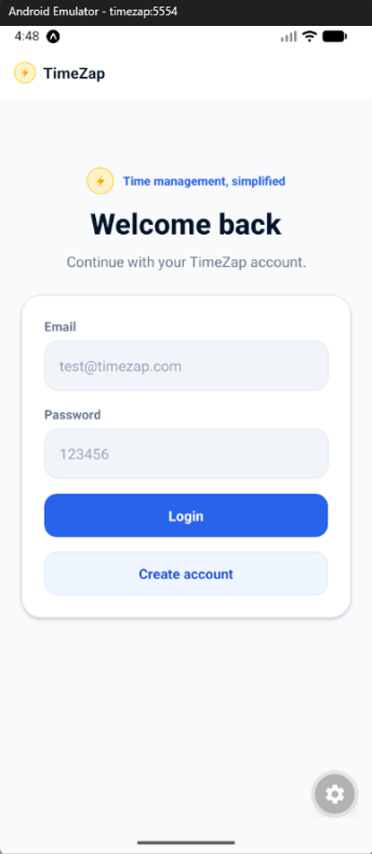

# TimeZap

**Task & Habit Management Information System**

TimeZap is a full-stack task and habit management application developed as a thesis project. It supports authenticated task planning, recurring habit tracking, dashboard summaries, calendar views, user settings, localization, notifications/reminders, and optional Gemini-powered AI Suggestions.

## Thesis Context

- Thesis topic: "Design and implementation of task and habit management information systems"
- Supervisor: Efthimios Alepis
- Author: Angelo Bordeianu

## Preview / Screenshots















## Main Features

- JWT authentication with account profile and password management.
- Task management with create, update, delete, complete, cancel, overdue, all-day, timed, and multi-day task support.
- Habit management with recurrence rules, active date ranges, daily logging, and optional end dates.
- Periodic habit progress for targets such as x times per week or x times per month.
- Streak tracking for recurring habits.
- Dashboard view for today's tasks, habits, and progress.
- Calendar views for scheduled tasks and habit completion context.
- Settings for account details, preferences, default view, week start, time format, timezone, theme, language, and notifications.
- Light, dark, and system theme modes.
- English, Greek, and Romanian localization.
- Backend notification center with read/unread state.
- Android local reminders where supported by the platform/build.
- SVG icon system for tasks, habits, and UI elements.
- Optional Gemini AI Suggestions for reviewed task and habit ideas.

## AI Suggestions

AI Suggestions are optional and are mediated by the backend only.

- The backend calls Gemini from `POST /api/ai/suggestions`.
- `GEMINI_API_KEY` stays in the backend `.env` file.
- The frontend never receives the Gemini key and never calls Gemini directly.
- Users review all suggested tasks and habits before adding them.
- Nothing is auto-created by the AI feature.
- If Gemini is not configured, the feature is unavailable and the rest of the app continues to work.

## Tech Stack

### Frontend

- React Native
- Expo
- React Native Web
- TypeScript
- React Navigation
- AsyncStorage
- `react-native-svg`
- Expo Notifications

### Backend

- Node.js
- Express.js
- PostgreSQL
- JWT
- bcrypt
- Gemini API

## Architecture Overview

```text
Frontend Web/Android
  ↓
Express REST API
  ↓
PostgreSQL
```

AI Suggestions flow:

```text
Frontend AI Modal → Backend /api/ai/suggestions → Gemini API → Backend validation → Frontend suggestion cards
```

Notification flow:

```text
Backend notifications table → Frontend notification center → Android local scheduling where supported
```

See [docs/architecture.md](docs/architecture.md) for the detailed architecture.

## Project Structure

```text
backend/        Express REST API, PostgreSQL access, authentication, business rules
frontend/       Expo React Native app for web and Android
docs/           Architecture, API, database, testing, screenshots, and thesis material
docs/thesis/    Thesis master draft and generated thesis document files
```

## Setup Instructions

### Backend

```bash
cd backend
npm install
```

Copy the environment template:

```cmd
copy .env.example .env
```

```powershell
Copy-Item .env.example .env
```

macOS/Linux:

```bash
cp .env.example .env
```

Fill the database variables in `.env`. Add `GEMINI_API_KEY` only if the AI Suggestions feature is needed.

```bash
npm start
```

Development mode:

```bash
npm run dev
```

Health checks:

```text
http://localhost:3000/api/health
http://localhost:3000/api/db-health
```

### Frontend

```bash
cd frontend
npm install
npm run web
npm run android
```

The frontend currently uses these API base URLs:

- Web: `http://localhost:3000/api`
- Android emulator: `http://10.0.2.2:3000/api`

## Environment Variables

Backend `.env` placeholders:

```env
PORT=
DB_HOST=
DB_PORT=
DB_NAME=
DB_USER=
DB_PASSWORD=
JWT_SECRET=
JWT_EXPIRES_IN=
GEMINI_API_KEY=
GEMINI_MODEL=
```

Do not commit real credentials, passwords, tokens, API keys, or production values.

## PostgreSQL Setup

- Create a PostgreSQL database for TimeZap.
- Create or select a PostgreSQL user with access to that database.
- Run `backend/database/schema.sql` if the schema needs to be created manually.
- The backend also includes safe runtime schema preparation for V1 columns, indexes, and the notifications table when they are missing.
- Do not use seed or schema files to overwrite an existing database that contains important data.

## API Overview

- `/api/auth`
- `/api/tasks`
- `/api/habits`
- `/api/dashboard`
- `/api/calendar`
- `/api/settings`
- `/api/notifications`
- `/api/ai/suggestions`

See [docs/api.md](docs/api.md) for endpoint details.

## Documentation

- [Documentation Index](docs/README.md)
- [Architecture](docs/architecture.md)
- [Database](docs/database.md)
- [API](docs/api.md)
- [Testing](docs/testing.md)
- [Screenshots](docs/screenshots.md)
- [Thesis Material](docs/thesis-material.md)
- [Thesis Master Draft](docs/thesis/TimeZap_Thesis_Master_Draft.md)

## Testing

Recommended verification commands and checks:

```bash
cd frontend
npm run typecheck
npx expo export --platform web
```

Backend verification:

- Start the backend with `npm start`.
- Check `/api/health`.
- Check `/api/db-health` when PostgreSQL is available.

Manual test coverage is tracked in [docs/testing.md](docs/testing.md).

## Known Limitations

- No Google Calendar sync.
- No server push notifications.
- No app store deployment.
- Native notification behavior depends on platform and build support.
- No full automated test suite yet.
- Gemini AI requires a backend API key.
- AI does not autonomously plan or create items.

## Future Work

- Google Calendar integration.
- Server push notifications.
- EAS/development build setup for native notification verification.
- Cloud deployment.
- Automated tests.
- Advanced analytics.
- Personalized AI suggestions.
- Collaborative tasks.

## Author

Angelo Bordeianu

GitHub: [antzelo005](https://github.com/antzelo005)
